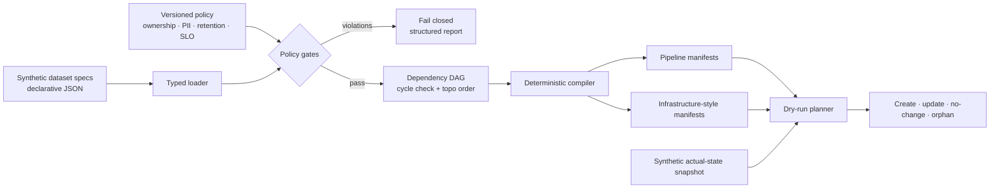

# Data Platform Control Plane — Synthetic Reference Implementation

> **Portfolio demo — synthetic resources only.** This repository does not provision
> cloud infrastructure, deploy pipelines, or manage production datasets. It
> compiles fictional onboarding specs into reviewable local manifests and dry-run
> plans.

A dependency-free control-plane prototype for declarative dataset onboarding:
policy-as-code gates, dependency DAG validation, deterministic pipeline and
infrastructure-style manifest compilation, dry-run planning, and drift detection.

## Why this project exists

Platform teams often receive onboarding intent in tickets, documents, and hand-built
pipelines. That makes ownership, classification, retention, reliability, and
dependency behavior difficult to enforce consistently.

This project turns that intent into a contract that can be validated before any
resource mutation:

- accountable owner, domain, description, tags, and explicit demo provenance;
- field schema with classification rollup and PII checks;
- classification-aware retention limits;
- freshness and availability SLO policy;
- source and delivery contracts;
- data-quality gates referencing real schema fields;
- dependency existence, self-reference, and cycle checks;
- deterministic deployment order and stable fingerprints;
- create/update/no-change/orphan dry-run plans;
- no apply command and no automatic deletion.

## Architecture



## Quick start

Python 3.11 or newer is required. Runtime dependencies: none.

```bash
make check
make demo
```

Validate every spec and cross-dataset policy:

```bash
PYTHONPATH=src python -m control_plane \
  --spec-dir examples/specs \
  --policy config/policy.json \
  validate
```

Review a dry-run plan against the intentionally stale synthetic snapshot:

```bash
PYTHONPATH=src python -m control_plane \
  --spec-dir examples/specs \
  --policy config/policy.json \
  plan --actual examples/actual_state.json
```

Compile local review artifacts:

```bash
PYTHONPATH=src python -m control_plane \
  --spec-dir examples/specs \
  --policy config/policy.json \
  compile --output artifacts
```

```text
artifacts/
├── bundle.json
├── pipelines/
│   ├── raw_orders.json
│   ├── curated_orders.json
│   └── daily_revenue.json
└── infrastructure/
    ├── raw_orders.json
    ├── curated_orders.json
    └── daily_revenue.json
```

Render the dependency graph:

```bash
PYTHONPATH=src python -m control_plane \
  --spec-dir examples/specs \
  --policy config/policy.json \
  graph --format mermaid
```

Container validation:

```bash
docker build -t data-control-plane-demo .
docker run --rm data-control-plane-demo
```

## Policy gates

| Area | Examples of enforced policy |
|---|---|
| Provenance | `synthetic=true`; `production_deployment=false` |
| Ownership | Owner must match a versioned accountable-team pattern |
| Schema | Safe unique names, supported types, valid partition and quality columns |
| Classification | Dataset level covers every field; PII is confidential or restricted |
| Retention | Positive and below classification-specific maximum |
| Reliability | Freshness and availability stay within platform policy |
| Dependency | Defined, unique, not self-referential, and acyclic |
| Source | Approved type/format; object-store demos use `synthetic://` |
| Delivery | Bronze/silver/gold layer and schema-backed partitions |

Validation collects discoverable violations across every spec. The compiler calls
the same gates and cannot emit a manifest from invalid intent.

## Compilation model

Each accepted dataset produces four stable resource intents:

1. catalog dataset—schema, owner, domain, classification, lineage;
2. batch pipeline—source, target, dependencies, quality gates, SLO;
3. object storage—synthetic location, encryption, private access, lifecycle;
4. dataset monitor—freshness, availability, and quality-gate count.

Resources and the full bundle receive SHA-256 fingerprints over canonical JSON.
There is deliberately no timestamp in desired state, so a no-op compile remains a
no-op.

## Dry-run plans and drift

The planner compares desired and actual fingerprints:

- `create`: desired resource is absent;
- `update`: resource exists but fingerprints differ;
- `no_change`: fingerprints match;
- `orphan`: actual resource is not managed by desired state.

`plan` always reports `dry_run=true` and `destructive_actions=false`. `drift`
returns exit status 2 when drift exists, suitable for a CI check. Orphans are
never deleted automatically.

## Repository map

```text
.
├── config/policy.json
├── examples/
│   ├── specs/
│   └── actual_state.json
├── src/control_plane/
│   ├── models.py
│   ├── policy.py
│   ├── graph.py
│   ├── compiler.py
│   ├── planner.py
│   └── cli.py
├── tests/
├── docs/
│   ├── RUNBOOK.md
│   └── adr/0001-compile-intent-before-mutation.md
├── .github/workflows/ci.yml
├── Dockerfile
└── Makefile
```

## Test strategy

The offline test suite covers ownership, provenance, PII classification rollup,
retention, SLO, partition/schema references, missing dependencies, cycles,
deterministic topological order, stable compilation, secure manifest defaults,
split-artifact output, no-drift and drift plans, orphan safety, and CLI behavior.

GitHub Actions runs Python 3.11 and 3.12, validates and compiles the sample intent,
uploads generated synthetic manifests, and smoke-tests the container.

## Productionization path

| Demo component | Production addition |
|---|---|
| JSON directory | Authenticated API/registry with schema evolution and audit log |
| Static policy file | OPA/Cedar policy service with reviewed policy rollout |
| Local compiler | Provider adapters for Terraform, orchestrator, catalog, IAM |
| File snapshot | Read-only cloud discovery with eventual-consistency handling |
| Fingerprint plan | Provider-native diff plus import/move semantics |
| No apply | Approval workflow, scoped credentials, locks, rollback and evidence |
| Local DAG | Orchestrator integration, partition semantics, backfill controls |

Before mutation is enabled, add tenant isolation, authorization, secret management,
concurrency locks, idempotency keys, provider rate limits, partial-failure recovery,
human approvals, audit storage, disaster recovery, and signed artifacts.

## Honest limitations

- No cloud, catalog, scheduler, Terraform, or broker API is called.
- Manifests are illustrative provider-neutral intent, not deployable Terraform.
- Drift is fingerprint-based against a supplied synthetic snapshot.
- There is no apply or delete command.
- PII classification is metadata validation, not automated data discovery.
- The examples and `synthetic://` locations are fictional.

See [ADR 0001](docs/adr/0001-compile-intent-before-mutation.md) for the safety
boundary and [RUNBOOK.md](docs/RUNBOOK.md) for a production-minded review flow.

